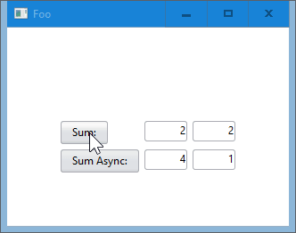

# Sciter.JS Rust Boilerplate

<h1 align="center">
  </a>  
</h1>

## Windows

Run `cargo build --release` and find the resulting executable in `target/release`.

Requires [`sciter.dll`](https://github.com/c-smile/sciter-js-sdk/blob/main/bin/windows/x64/sciter.dll) to be with the executable.

- [x] Call Rust (Sync) from JavaScript
- [x] Call Rust (Async) from JavaScript
- [ ] Call JavaScript from Rust
- [x] Set Executable Icon
- [x] Set Taskbar Icon
- [ ] Set Window Icon
- [x] Set Executable Metadata / Version Info
- [x] Pack Everything into Single Executable

## Linux

Loading, please wait ...

## Mac

Loading, please wait ...